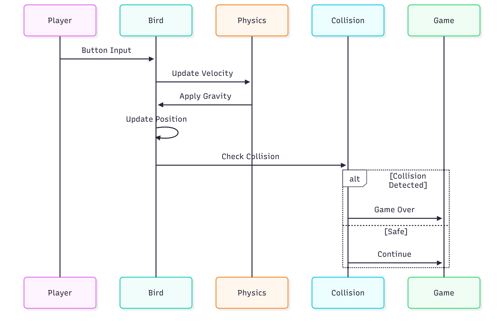
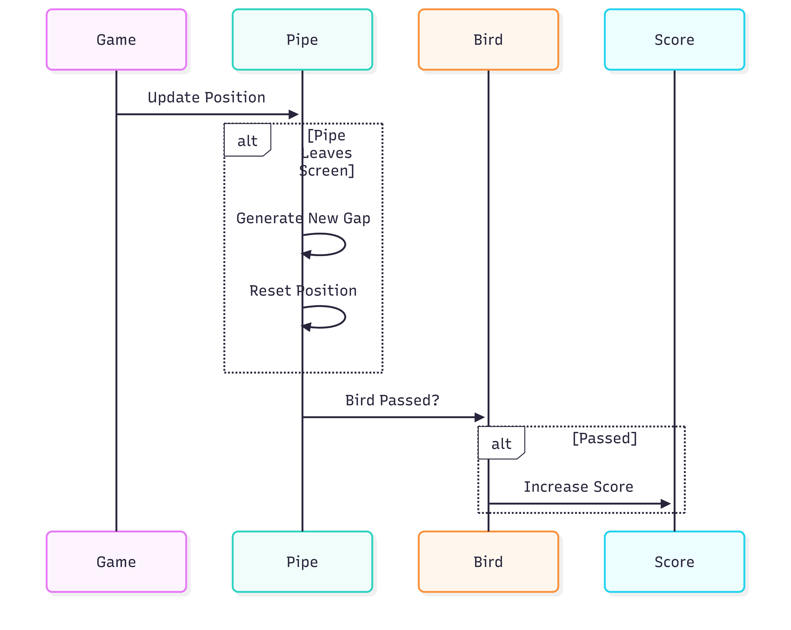
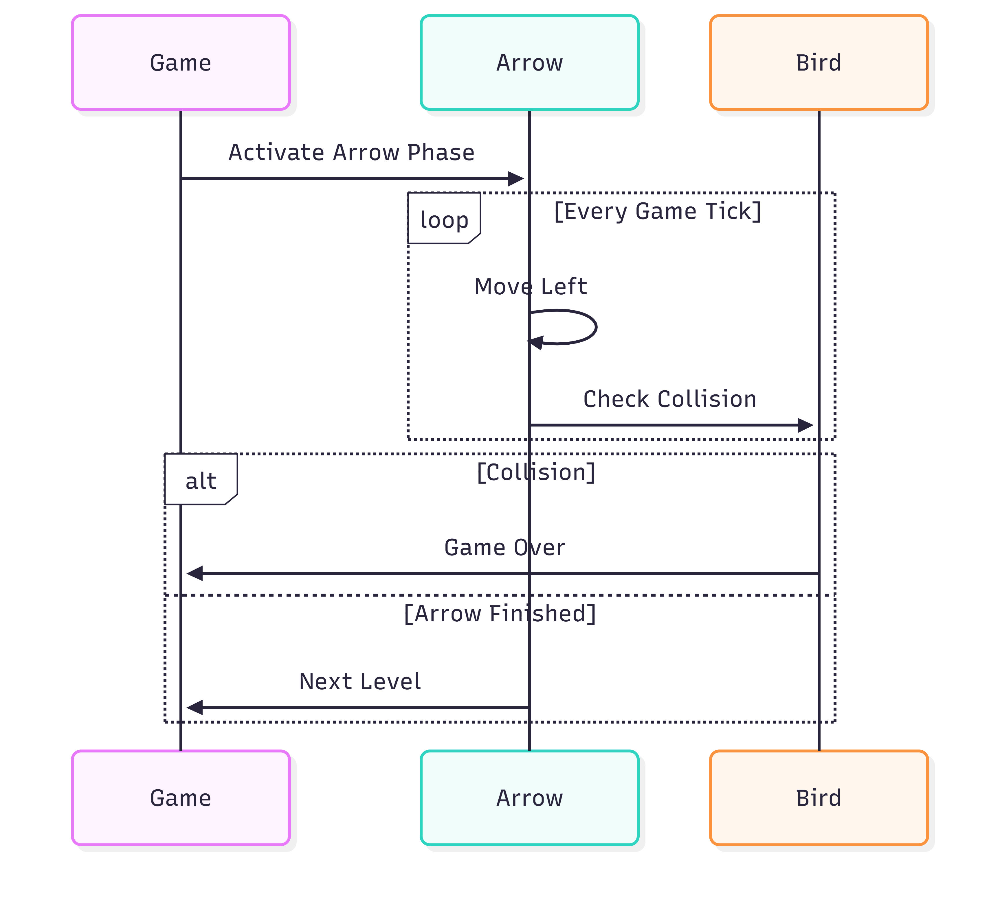
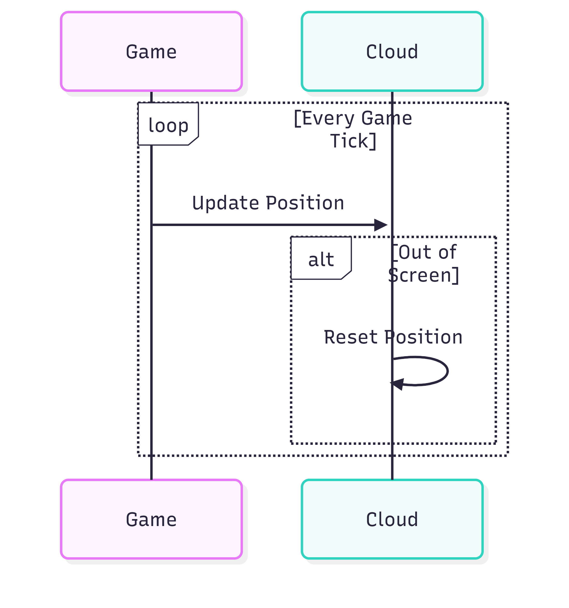
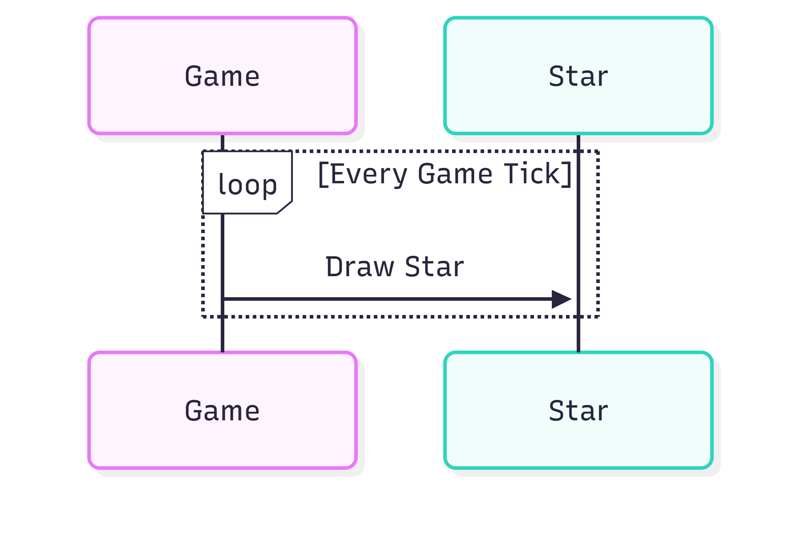
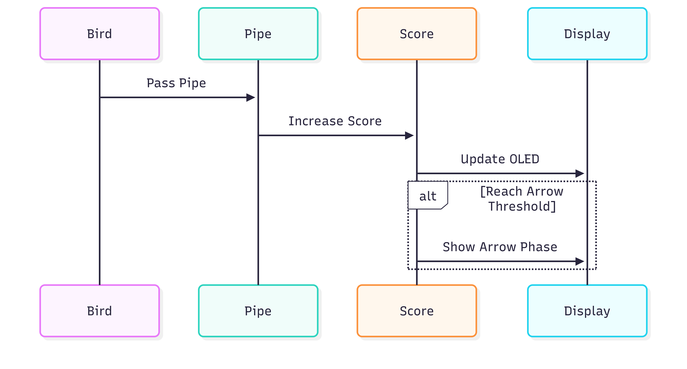
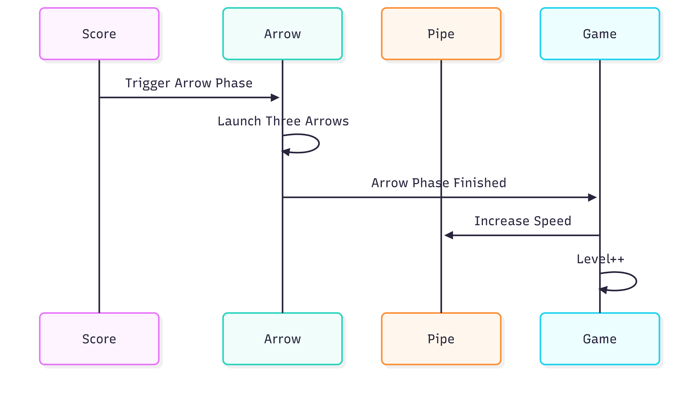
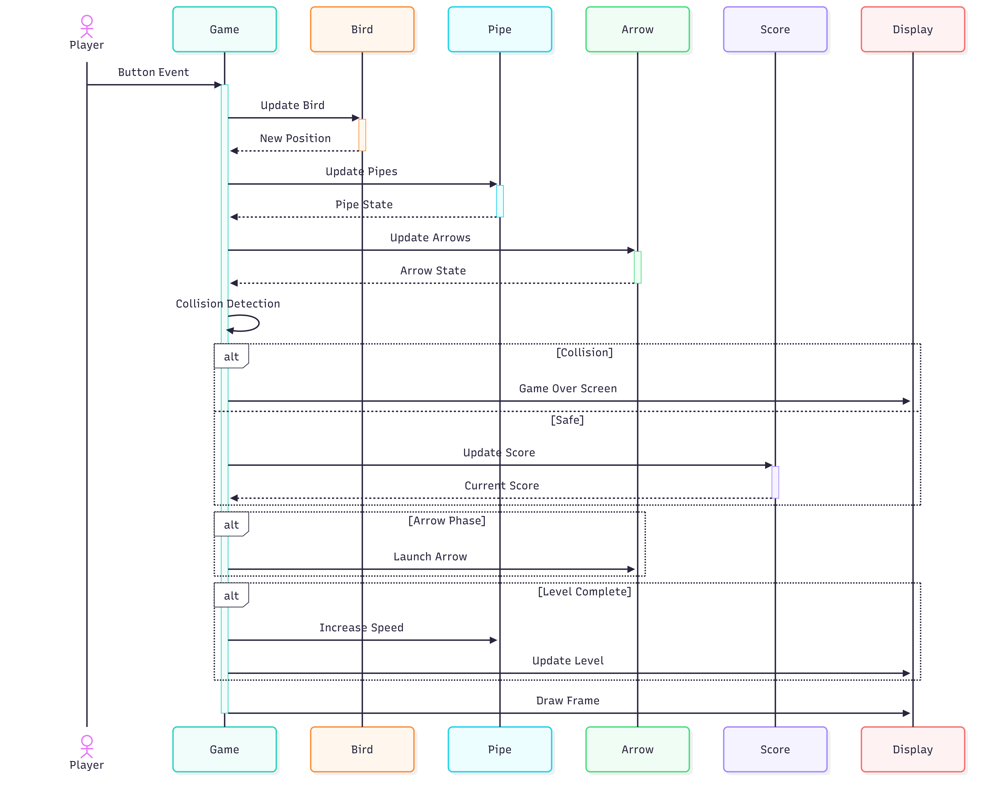

# Game Objects Design

## Introduction

This document describes the design of the gameplay objects used in the **Flappy Bird Game**. Each object is responsible for a specific task and interacts with the game controller through the event-driven framework.

The purpose of this document is to explain the behavior, properties, and relationships of all gameplay objects.

---

# Object Summary

| Object | Module | Main Responsibility |
|---------|--------|---------------------|
| Bird | `scr_flappy_game.cpp` | Controls the Bird movement, processes player input, applies gravity (or reverse gravity), and detects collisions with obstacles. |
| Pipe | `scr_flappy_game.cpp` | Generates pipe obstacles, updates their movement, randomizes the gap position, and increases the score when the Bird successfully passes through. |
| Arrow | `scr_flappy_game.cpp` | Manages the Arrow Phase, launches arrows after the required score is reached, detects collisions with the Bird, and signals the completion of the phase. |
| Cloud | `scr_flappy_game.cpp` | Updates cloud positions to create a continuous scrolling background animation. |
| Star | `scr_flappy_game.cpp` | Draws decorative stars in the background to enhance the visual appearance of the game. |
| Tree | `scr_flappy_game.cpp` | Scrolls foreground trees continuously to improve the environmental animation. |
| Game Controller | `scr_flappy_game.cpp` | Coordinates the gameplay loop, updates all objects, manages score and level progression, processes collisions, controls game states, and handles screen transitions. |

---

# Bird

## Description

The Bird is the player-controlled character. It responds to button input, moves vertically according to the selected game mode, and performs collision detection with obstacles and screen boundaries.

<b>Figure 1.</b> Bird object.

### Properties

| Property | Description |
|----------|-------------|
| Position | Current position on the screen |
| Velocity | Vertical movement speed |
| Gravity | Downward (or reverse) acceleration |
| State | Alive or Game Over |

### Responsibilities

- Process player input.
- Apply gravity.
- Move vertically.
- Detect collisions.
- Notify the Game Controller when a collision occurs.

## Bird Object Sequence

The Bird is the primary player-controlled object in the Flappy Bird Game. It is responsible for responding to player input, updating its movement based on the selected game mode, and interacting with gameplay obstacles. Throughout the game, the Bird continuously updates its position, checks for collisions, and determines whether the game should continue or transition to the Game Over state.

<b>Figure 2.</b> Bird Runtime Sequence.

Figure 2 illustrates the Bird object used throughout the game. The Bird is animated during gameplay and represents the main character controlled by the player.

---

# Pipe

## Description

Pipes are the primary obstacles during the Pipe Phase. They move continuously from right to left and are regenerated after leaving the screen.

<b>Figure 3.</b> Pipe object.

### Properties

| Property | Description |
|----------|-------------|
| Position | Current horizontal position |
| Gap | Opening for the Bird |
| Speed | Movement speed |

### Responsibilities

- Generate random gaps.
- Move left.
- Respawn after leaving the screen.
- Increase the player's score when successfully passed.

## Pipe Object Sequence

The Pipe is the primary obstacle encountered during normal gameplay. Pipes continuously move from the right side of the screen toward the Bird while maintaining a randomly generated gap. Successfully navigating through these gaps increases the player's score and gradually increases the game's difficulty.

<b>Figure 4.</b> Pipe Runtime Sequence.

Figure 4 shows the Pipe object. Pipes are regenerated after leaving the screen, creating an endless sequence of obstacles throughout the game.

---

# Arrow

## Description

The Arrow is a special obstacle introduced after the Bird reaches a predefined score. Unlike Pipes, Arrows move at higher speed and create a temporary challenge before the next level begins.

<b>Figure 3.</b> Arrow object.

### Properties

| Property | Description |
|----------|-------------|
| Position | Current position |
| Speed | Horizontal movement speed |
| Active | Arrow phase status |

### Responsibilities

- Move across the screen.
- Detect collision with the Bird.
- Trigger the next level after all Arrows are completed.

## Arrow Object Sequence

The Arrow is a special obstacle that appears after the player reaches a predefined score threshold. Unlike normal Pipes, Arrows move at a higher speed and introduce a temporary challenge before the next gameplay level begins.

<b>Figure 6.</b> Arrow Runtime Sequence

Figure 6 illustrates the Arrow obstacle used during the Arrow Phase. The player must avoid all incoming arrows in order to advance to the next level.

---

# Cloud

## Description

Clouds are decorative background objects. They slowly move across the screen to create a dynamic environment.

<b>Figure 4.</b> Cloud object.

### Responsibilities

- Move slowly.
- Loop when leaving the screen.
- Provide background animation.

## Cloud Object Sequence

Clouds are decorative background objects that provide a more dynamic visual environment. Although they do not interact with the Bird or influence gameplay, they continuously scroll across the screen to improve the overall presentation.

<b>Figure 8.</b> Cloud Runtime Sequence.

Figure 8 shows one of the background Cloud objects used to create a continuous scrolling sky.

---

# Star

## Description

Stars are decorative background objects displayed in the sky. They do not affect gameplay.

<b>Figure 5.</b> Star object.

### Responsibilities

- Decorative rendering.
- Background animation.

## Star Object Sequence

Stars are decorative objects rendered in the background to create a richer visual atmosphere. They remain independent from the gameplay logic and serve only as graphical enhancements.

<b>Figure 10.</b> Star Runtime Sequence.

Figure 10 illustrates the Star object displayed throughout the game background.

---

# Tree

## Description

Trees are decorative foreground objects placed near the ground to enrich the game scene.

<b>Figure 6.</b> Tree object.

### Responsibilities

- Decorative rendering.
- Continuous scrolling.
- Foreground animation.

## Tree Object Sequence

Trees are foreground decorative objects positioned near the ground. Together with the Clouds and Stars, Trees contribute to the illusion of continuous movement and create a more immersive gameplay environment.

<b>Figure 12.</b> Tree Runtime Sequence.

Figure 12 shows the Tree object rendered near the bottom of the screen to provide foreground scenery during gameplay.

---

# Score

## Description

The Score system records the player's progress throughout the game. A point is awarded each time the Bird successfully passes through a Pipe. The current score is displayed during gameplay and is also used to determine when the Arrow Phase should be activated.

### Properties

| Property | Description |
|----------|-------------|
| Current Score | Total score obtained by the player |
| High Score | Highest score stored by the game |
| Arrow Threshold | Score required to trigger the Arrow Phase |

### Responsibilities

- Increase the score after passing a Pipe.
- Update the score display.
- Compare the current score with the high score.
- Notify the Game Controller when the Arrow Phase should begin.

### Runtime Sequence

<b>Figure 13.</b> Score runtime sequence.

The Score system increases whenever the Bird successfully passes a Pipe. After updating the display, it checks whether the predefined score threshold has been reached. If so, it notifies the Game Controller to activate the Arrow Phase.

---

# Level

## Description

The Level system controls the overall game progression. After the Arrow Phase has been completed successfully, the game advances to the next level by increasing the obstacle movement speed, making the gameplay progressively more challenging.

### Properties

| Property | Description |
|----------|-------------|
| Current Level | Current gameplay level |
| Pipe Speed | Pipe movement speed |
| Arrow Phase | Indicates whether the special phase is active |

### Responsibilities

- Manage gameplay progression.
- Increase difficulty after each completed Arrow Phase.
- Update movement speed.
- Display the current level.

### Runtime Sequence

<b>Figure 14.</b> Level runtime sequence.

After the required score is reached, the Arrow Phase begins. Once all arrows have been cleared successfully, the Level system increases the gameplay difficulty by advancing the level and increasing the movement speed of subsequent obstacles.

---

# Game Controller

## Description

The Game Controller coordinates all gameplay objects and controls the overall game flow.

### Responsibilities

- Initialize objects.
- Update gameplay.
- Switch between Pipe Phase and Arrow Phase.
- Update score and level.
- Detect Game Over.
- Manage screen transitions.

---

# Object Interaction

## Game Object Interaction Sequence

All gameplay objects are coordinated by the Game Controller through a continuous update cycle. During every game tick, the controller updates object states, processes player input, performs collision detection, updates the score, manages level progression, and finally renders the complete frame to the OLED display.

<b>Figure 15.</b> Object interaction overview.

Figure 15 illustrates the relationships between the Bird, gameplay obstacles, decorative objects, and the Game Controller during a single game update cycle.

