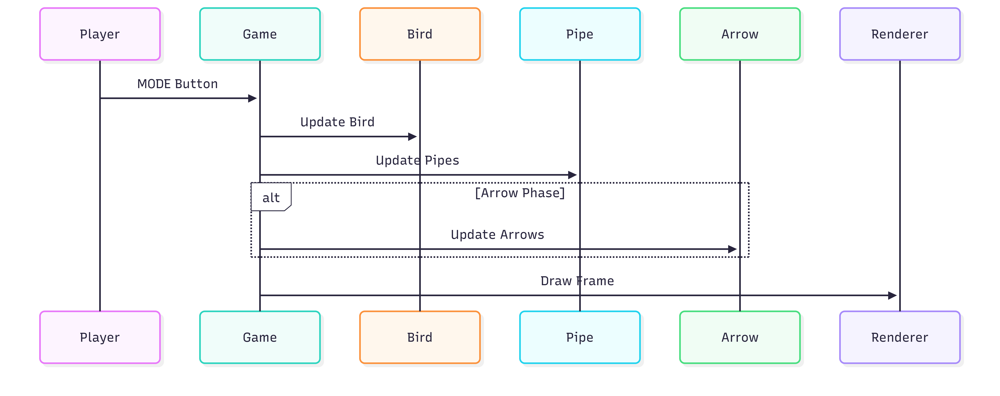
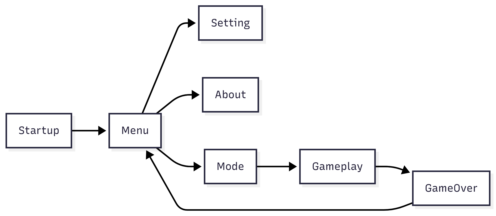
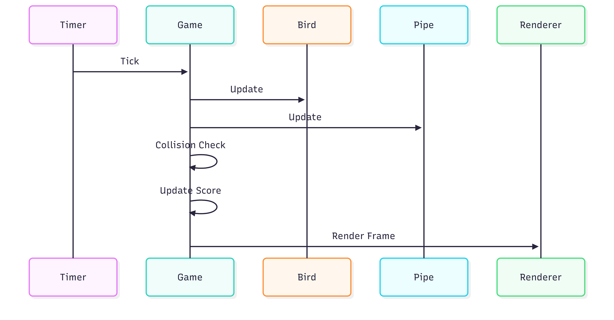
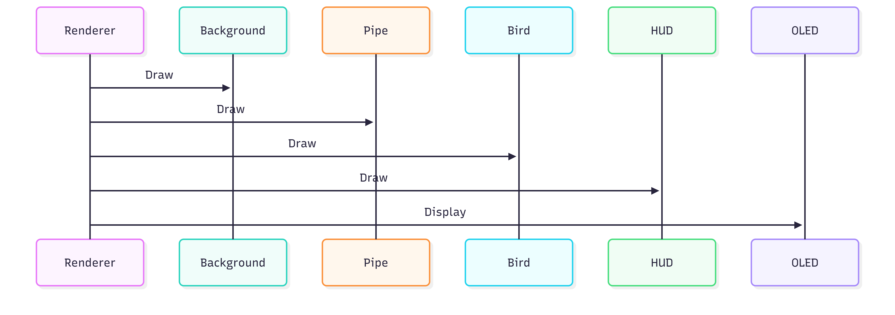

# Runtime Design

## Introduction

This document describes the runtime architecture of the **Flappy Bird Game**. It explains how the game processes player input, updates gameplay objects, manages runtime states, and renders graphics on the OLED display.

Unlike the previous document, which focuses on the behavior of individual gameplay objects, this document describes how all modules cooperate during execution. The game follows an **event-driven architecture**, where a periodic timer triggers gameplay updates and the Game Controller coordinates every runtime operation.

---

# Runtime Architecture

## Overview

The runtime architecture consists of several independent modules working together during each game tick.

- The **Button Driver** receives player input.
- The **Game Controller** coordinates all gameplay logic.
- Gameplay objects update their internal states.
- The **Renderer** refreshes the OLED display.
- The entire system is synchronized by a periodic timer.

<b>Figure 1.</b> Runtime architecture of the Flappy Bird Game.

Figure 1 illustrates the overall runtime architecture. The Game Controller acts as the central component that coordinates player input, gameplay updates, score management, and rendering.

---

# Runtime State Machine

## Overview

The Flappy Bird Game is organized into several runtime states. Each state represents a different stage of execution, from system startup to gameplay and Game Over.

Player input and gameplay events determine when transitions occur between these states.

<b>Figure 2.</b> Runtime state machine.

Figure 2 illustrates the runtime state transitions of the Flappy Bird Game. After startup, the player enters the Main Menu, where gameplay settings can be configured or project information can be viewed. Once a game mode is selected, the system enters the Gameplay state. During gameplay, the game may temporarily switch to the Arrow Phase before returning to the normal Pipe Phase. Any collision immediately transfers the system to the Game Over state.

### Runtime States

| State | Description |
|--------|-------------|
| Startup | Initializes the framework and hardware peripherals. |
| Main Menu | Displays the main menu and waits for user selection. |
| Setting | Allows the player to configure gameplay options. |
| About | Displays project information. |
| Mode Selection | Lets the player choose between Normal Mode and Reverse Mode. |
| Gameplay | Executes the main Flappy Bird gameplay loop. |
| Arrow Phase | Activates the special Arrow challenge after reaching the required score. |
| Game Over | Stops gameplay and displays the final score before returning to the Main Menu. |

---

# Runtime Execution

During gameplay, the runtime repeatedly performs the same execution cycle.

Each timer tick consists of the following operations:

1. Read player input.
2. Update Bird movement.
3. Update gameplay objects.
4. Detect collisions.
5. Update score.
6. Update level.
7. Render the OLED display.

The runtime cycle continues until the Bird collides with an obstacle or reaches a Game Over condition.

---

# Runtime Flow

## Overview

During gameplay, the system repeatedly executes a fixed runtime cycle driven by a periodic timer event. Every timer tick updates the gameplay objects in a predefined order to ensure smooth animation, deterministic behavior, and consistent game logic.

The runtime flow begins by reading player input, followed by updating gameplay objects, checking collisions, updating the score and level, and finally rendering the completed frame to the OLED display.

<b>Figure 3.</b> Runtime flow of one gameplay update.

Figure 3 presents the execution flow of a single gameplay update. Every timer tick follows the same sequence, ensuring that player input, gameplay logic, collision detection, score management, and rendering remain synchronized throughout the game.

---

# Player Input Processing

Player interaction is performed using the MODE button.

Depending on the selected gameplay mode, the Game Controller interprets the button input differently.

- **Normal Mode**
  - Pressing the MODE button makes the Bird fly upward.
  - Gravity continuously pulls the Bird downward.

- **Reverse Mode**
  - Gravity continuously pulls the Bird upward.
  - Pressing the MODE button moves the Bird downward.

The processed input is forwarded to the Bird Controller before gameplay objects are updated.

---

# Timer Processing

The periodic timer serves as the heartbeat of the game.

Every timer event performs the following operations:

1. Read player input.
2. Update Bird movement.
3. Update Pipe movement.
4. Update Arrow movement (if active).
5. Detect collisions.
6. Update score.
7. Update level.
8. Render the OLED display.

Because every gameplay object is updated during the same timer event, animations remain synchronized throughout the game.

---

# Collision Processing

Collision detection is executed immediately after all gameplay objects have completed their movement update.

The Bird is tested against:

- Pipes
- Arrows
- Screen boundaries.

Whenever a collision is detected, the Game Controller immediately terminates the gameplay loop and switches the runtime state to **Game Over**.

Collision detection is performed before rendering to ensure that the OLED always displays the correct gameplay state.

---

# Score and Level Processing

The Score Manager continuously monitors the player's progress.

Whenever the Bird successfully passes through a Pipe:

- The current score is increased.
- The OLED display is updated.

After the predefined score threshold is reached:

- The Arrow Phase is activated.
- The player must successfully avoid every Arrow.
- When the Arrow Phase finishes, the current level increases.
- Pipe movement speed is increased to provide greater gameplay difficulty.

This mechanism allows the game to gradually become more challenging while preserving the same core gameplay mechanics.

---

# Rendering Pipeline

After all gameplay logic has completed, the Renderer constructs the next OLED frame.

Gameplay objects are rendered in the following order:

1. Background
2. Clouds
3. Stars
4. Pipes
5. Bird
6. Arrows
7. Trees
8. Score
9. Level

Drawing objects in a fixed order ensures that foreground objects correctly overlap background decorations.

<b>Figure 4.</b> Rendering pipeline.

Figure 4 illustrates the rendering order used by the Flappy Bird Game. Decorative background objects are rendered first, followed by gameplay objects and finally the user interface before the completed frame is transferred to the OLED display.

---

# Runtime Characteristics

The runtime architecture provides several important characteristics:

- Event-driven execution.
- Deterministic gameplay updates.
- Modular object management.
- Consistent rendering order.
- Smooth gameplay animation.
- Easy extensibility for future gameplay features.

These characteristics simplify software maintenance while ensuring predictable gameplay behavior on the embedded platform.

---

# Code References

The runtime of the Flappy Bird Game is implemented across several source files. Each module is responsible for a specific part of the execution flow.

| Module | File | Description |
|--------|------|-------------|
| Startup Screen | `scr_startup.cpp` | Displays the startup logo before entering the Main Menu. |
| Main Menu | `scr_flappy_menu.cpp` | Displays the Main Menu and processes menu navigation. |
| Mode Selection | `scr_flappy_mode.cpp` | Allows the player to select the gameplay mode. |
| Gameplay | `scr_flappy_game.cpp` | Implements gameplay logic, object updates, collision detection, score calculation, level progression, and rendering. |
| About Screen | `scr_about.cpp` | Displays project information. |
| Bitmap Resources | `screens_bitmap.cpp` | Stores bitmap images used by the game. |

---

# Module Responsibilities

The runtime is divided into several independent modules. Each module performs a dedicated task while being coordinated by the Game Controller.

| Module | Responsibility |
|--------|----------------|
| Game Controller | Coordinates the entire gameplay loop and manages runtime states. |
| Bird | Processes player input, applies gravity, updates Bird movement, and detects collisions. |
| Pipe | Generates, updates, and recycles pipe obstacles. |
| Arrow | Controls the Arrow Phase and updates Arrow movement. |
| Cloud | Updates decorative cloud animation. |
| Star | Draws decorative stars in the background. |
| Tree | Updates foreground tree scrolling. |
| Renderer | Draws all gameplay objects and refreshes the OLED display. |

---

# Button Event Processing

Player interaction is performed through the hardware buttons. Different screens interpret button events differently.

| Button | Screen | Action |
|--------|--------|--------|
| UP | Main Menu | Move the menu cursor upward. |
| DOWN | Main Menu | Move the menu cursor downward. |
| MODE | Main Menu | Select the highlighted menu item. |
| UP / DOWN | Mode Selection | Select Normal Mode or Reverse Mode. |
| MODE | Mode Selection | Confirm the selected gameplay mode. |
| MODE | Gameplay (Normal Mode) | Make the Bird fly upward. |
| MODE | Gameplay (Reverse Mode) | Make the Bird move downward. |
| MODE | Game Over | Return to the Main Menu. |

---

# Runtime Scheduling Notes

The Flappy Bird Game follows a periodic timer-driven scheduling model.

Every timer tick executes the gameplay loop in a fixed order to ensure deterministic behavior and smooth animation.

The update sequence is:

1. Read player input.
2. Update Bird movement.
3. Update Pipe movement.
4. Update Arrow movement (if active).
5. Detect collisions.
6. Update score.
7. Update level progression.
8. Render the OLED display.

Maintaining a fixed execution order guarantees that all gameplay objects remain synchronized throughout the game.

---

# Runtime Events

Runtime communication is performed through events generated by user input and gameplay logic.

| Event | Source | Destination |
|-------|--------|-------------|
| Button Press | Button Driver | Game Controller |
| Timer Tick | System Timer | Game Controller |
| Bird Collision | Bird | Game Controller |
| Pipe Passed | Pipe | Score Manager |
| Arrow Phase Completed | Arrow | Level Manager |
| Game Over | Game Controller | Game Over Screen |

---

# Runtime Data

Several runtime variables are continuously updated during gameplay.

| Runtime Data | Description |
|--------------|-------------|
| Bird Position | Current Bird coordinates on the screen. |
| Bird Velocity | Current vertical movement speed. |
| Current Score | Player's current score. |
| Best Score | Highest recorded score. |
| Current Level | Current gameplay level. |
| Arrow Phase | Indicates whether the Arrow challenge is active. |
| Game State | Current runtime state of the game. |

---

# Runtime Characteristics

The runtime architecture provides several important characteristics:

- Event-driven execution.
- Modular software architecture.
- Deterministic gameplay updates.
- Consistent rendering order.
- Smooth animation on the OLED display.
- Easy maintenance and future feature extension.

These characteristics make the runtime simple to understand while ensuring reliable execution on the AK Embedded platform.

---

# Summary

The Flappy Bird Game follows an event-driven runtime architecture in which every gameplay update is synchronized by a periodic timer.

During each runtime cycle, player input is processed, gameplay objects are updated, collisions are evaluated, score and level progression are managed, and the completed frame is rendered to the OLED display.

The Game Controller acts as the central coordinator, allowing every gameplay module to operate independently while remaining synchronized throughout execution. This modular design improves software maintainability, simplifies debugging, and provides a scalable foundation for future gameplay enhancements.

# Summary

The Flappy Bird Game follows an event-driven runtime architecture in which every gameplay update is synchronized by a periodic timer.

During each runtime cycle, player input is processed, gameplay objects are updated, collisions are evaluated, score and level progression are managed, and the completed frame is rendered to the OLED display.

By separating gameplay logic into independent runtime components coordinated by the Game Controller, the software remains modular, maintainable, and scalable for future feature development.
