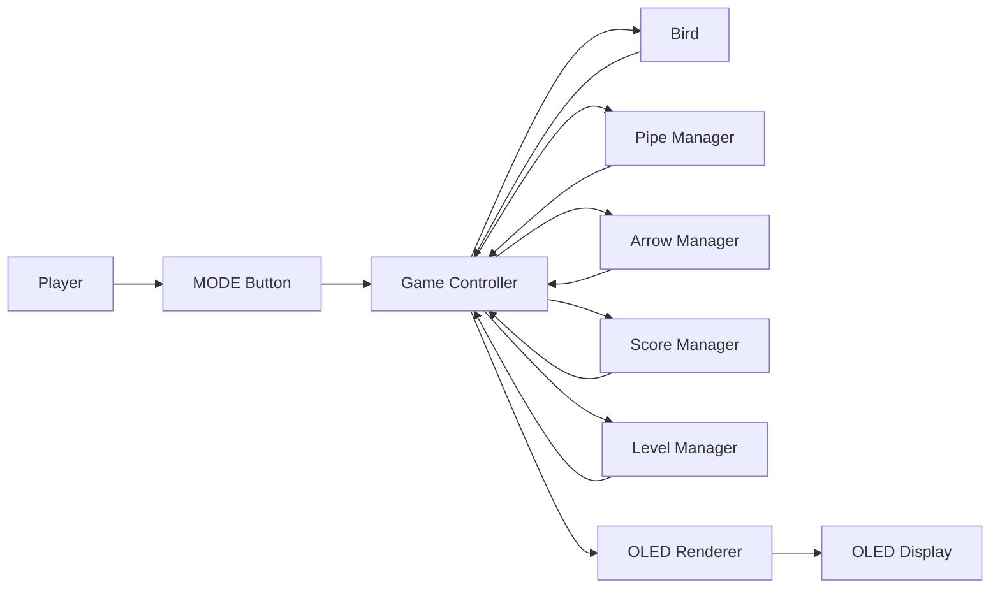
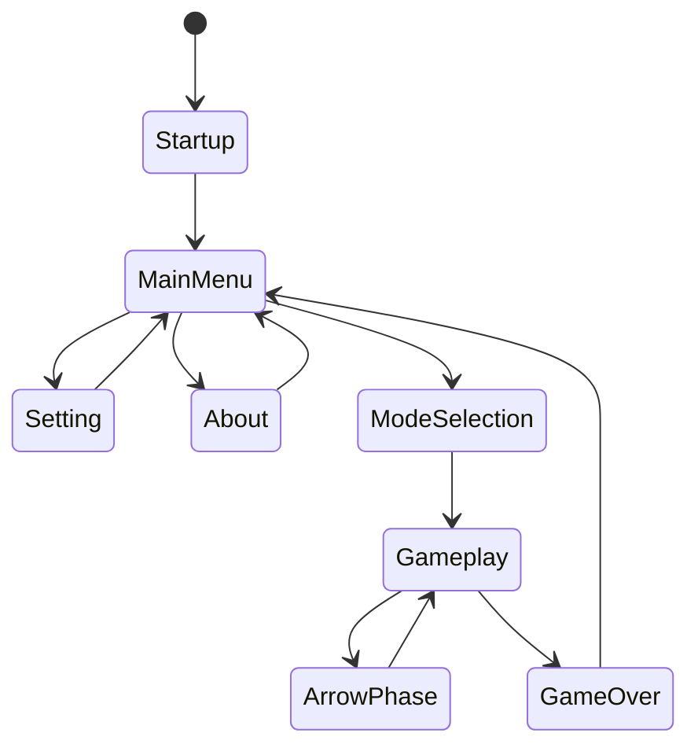

# Runtime Design

## Introduction

This document describes the runtime architecture of the **Flappy Bird Game**. It explains how the game processes player input, updates gameplay objects, manages runtime states, and renders graphics on the OLED display.

Unlike the previous document, which focuses on the behavior of individual gameplay objects, this document describes how all modules cooperate during execution. The game follows an **event-driven architecture**, where a periodic timer triggers gameplay updates and the Game Controller coordinates every runtime operation.

---

# Runtime Architecture

## Overview

The runtime architecture consists of several independent modules working together during each game tick.

- The **Button Driver** receives player input.
- The **Game Controller** coordinates all gameplay logic.
- Gameplay objects update their internal states.
- The **Renderer** refreshes the OLED display.
- The entire system is synchronized by a periodic timer.

<b>Figure 1.</b> Runtime architecture of the Flappy Bird Game.

Figure 1 illustrates the overall runtime architecture. The Game Controller acts as the central component that coordinates player input, gameplay updates, score management, and rendering.

### Runtime Architecture Diagram

---

# Runtime State Machine

## Overview

The Flappy Bird Game is organized into several runtime states. Each state represents a different stage of execution, from system startup to gameplay and Game Over.

Player input and gameplay events determine when transitions occur between these states.

<b>Figure 2.</b> Runtime state machine.

Figure 2 shows the state transitions implemented by the runtime system.

### Runtime State Machine

### Runtime States

| State | Description |
|--------|-------------|
| Startup | Initializes the framework and hardware peripherals. |
| Main Menu | Displays the main menu and waits for user selection. |
| Setting | Allows the player to configure gameplay options. |
| About | Displays project information. |
| Mode Selection | Lets the player choose between Normal Mode and Reverse Mode. |
| Gameplay | Executes the main Flappy Bird gameplay loop. |
| Arrow Phase | Activates the special Arrow challenge after reaching the required score. |
| Game Over | Stops gameplay and displays the final score before returning to the Main Menu. |

---

# Runtime Execution

During gameplay, the runtime repeatedly performs the same execution cycle.

Each timer tick consists of the following operations:

1. Read player input.
2. Update Bird movement.
3. Update gameplay objects.
4. Detect collisions.
5. Update score.
6. Update level.
7. Render the OLED display.

The runtime cycle continues until the Bird collides with an obstacle or reaches a Game Over condition.
