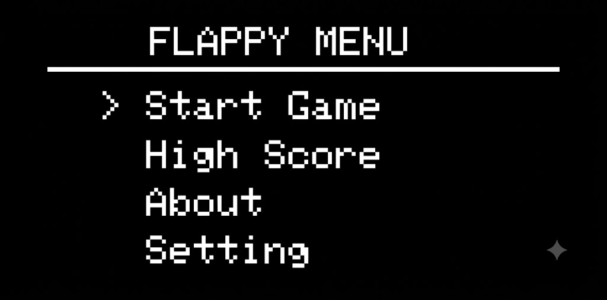
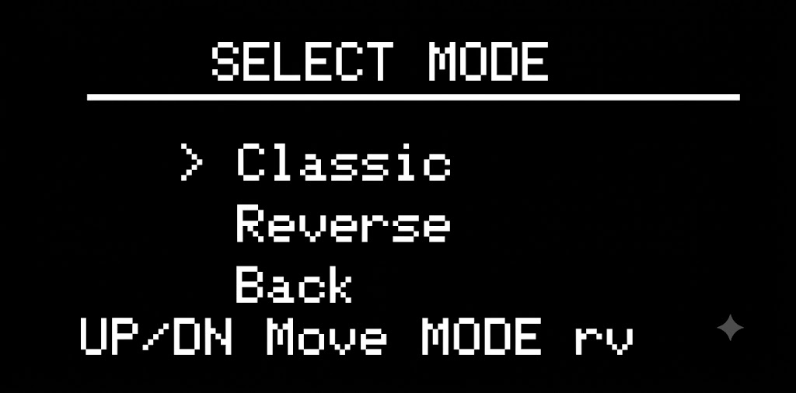
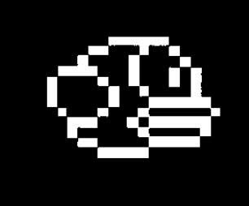
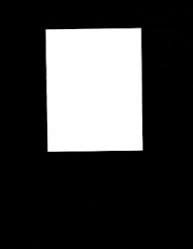
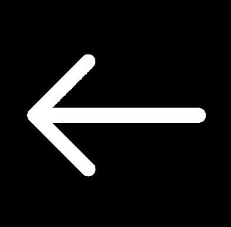
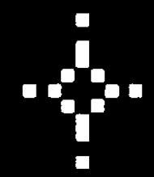
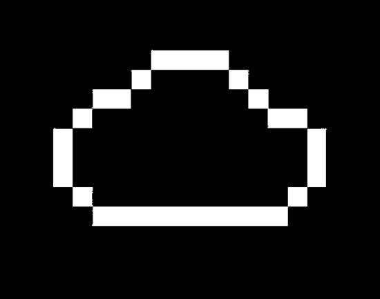
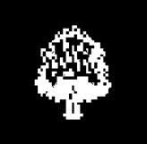
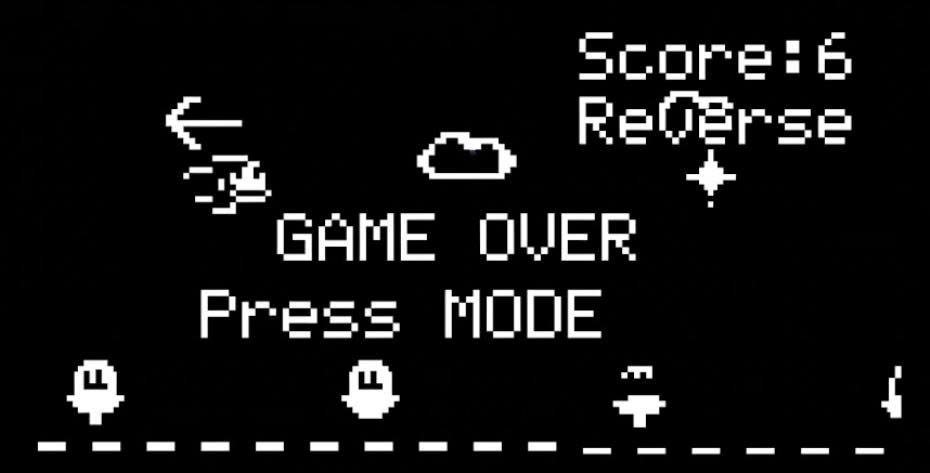
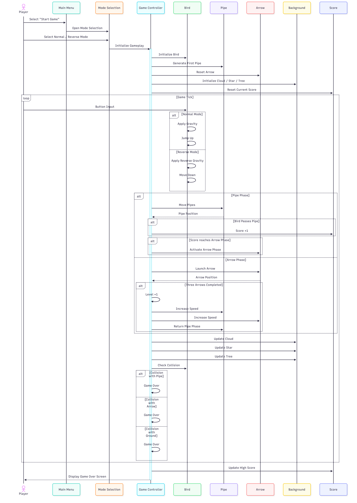

<div align="center">
  


</div>

# Flappy Bird Game - Game built on AK Embedded Base Kit

<div align="center">
  
  <br>
  <em>Figure 1. Gameplay Screen</em>
</div>

# Gameplay demo


<div align="center">
  <video src="https://github.com/user-attachments/assets/dbf64976-78c0-44e9-a612-25b0aa40bf5b" width="300%" max-width="1400px" controls></video>
  <br>
  <em>Gameplay demo</em>
</div>
# Documentation

| File | Description |
|------|-------------|
| README.md | Main project overview, hardware information, gameplay rules, and game object descriptions. |
| docs/01-guide-getting-started.md | Getting started guide for building and running the project. |
| docs/02-guide-coding-rules.md | Coding conventions and project development guidelines. |
| docs/03-design-game-objects.md | Design and behavior of gameplay objects: Bird, Pipe, Ground, Score, and UI. |
| docs/04-design-runtime.md | Runtime event flow, game loop, state machine, button handling, and rendering process. |

# Introduction

Flappy Bird is a side-scrolling arcade game built on top of the AK Embedded Base Kit — an educational platform designed for learning modern embedded software development through interactive applications. The project recreates the classic Flappy Bird gameplay on a 128×64 OLED display using the STM32L151 microcontroller and the AK Embedded Framework.

While developing and playing Flappy Bird, you will explore several core concepts of embedded systems engineering:

- Software architecture: Organizing the application into independent screens, game objects, and reusable modules.
- Event-driven programming: Processing button inputs, timers, and system events to create responsive gameplay.
- Real-time game loop: Updating object positions, rendering graphics, detecting collisions, and calculating scores at fixed intervals.
- State management: Implementing finite state machines to control screen transitions, gameplay flow, and game-over conditions.

<div align="center">
  
  <br>
  <em>Figure 2. AK Foundation</em>
</div>

This kit would not have been possible without the help of [EPCB](https://epcb.vn/pages/frontpage).

AK Embedded Base Kit, utilizing STM32L151 MCU, is an evaluation kit for advanced embedded software learners.

## I. Features

- This kit integrates 1.54" Oled LCD, 3 push buttons, and 1 buzzer, which would be sufficient to create a small video game with an event driven paradigm.
- It also includes RS485, Qwiic Connect System, and Grove Ecosystems, suitable for prototyping other practical applications in embedded systems.

<div align="center">
  
  <br>
  <em>Figure 3. AK Embedded Base Kit - STM32L151</em>
</div>

### Purpose

Students who are enrolled in the AK foundation's embedded training program will make use of this evaluation kit to develop a small unique video game that will be able to run smoothly as well as closely follow an event driven paradigm in embedded systems programming. This repository also contains all the code which would form the AK framework that students can use to facilitate their development process.

We also hope that this repository will also be useful for those are on the look out for a well-built kit to practice their embedded systems programming skills.

<div align="center">
  
  <br>
  <em>Figure 4. AK MCU KIT</em>
</div>

### Memory map

AK base kit uses the following memory map to run its application code

- [ 0x08000000 ] : **Boot** [[ak-base-kit-stm32l151-boot.bin]](https://github.com/ak-embedded-software/ak-base-kit-stm32l151/blob/main/hardware/bin/ak-base-kit-stm32l151-boot.bin)
- [ 0x08002000 ] : **BSF** [ Memory for data sharing between Boot and Application ]
- [ 0x08003000 ] : **Application** [[ak-base-kit-stm32l151-application.bin]](https://github.com/ak-embedded-software/ak-base-kit-stm32l151/blob/main/hardware/bin/ak-base-kit-stm32l151-application.bin)                                             |

>**Note:** After loading the boot and application firmware, you can use [AK - Flash](https://github.com/ak-embedded-software/ak-flash), a CLI to work with the AK base kit, to load the application directly through the kit's USB port. Once installed, the following command will flash user's defined code into the kit's application's memory region.

```sh
ak_flash /dev/ttyUSB0 ak-base-kit-stm32l151-application.bin 0x08003000
```

### Hardware

[AK base kit's schematic](/hardware/schematic/schematic-ak-embedded-base-kit-version-3.pdf)

<div align="center">
  
  <br>
  <em>Figure 5. Board view top</em>
</div>


<div align="center">
  
  <br>
  <em>Figure 6. Board view bottom</em>
</div>


### Reference

| Topic | Link |
| ------ | ------ |
| Training course | <https://github.com/the-ak-foundation/embedded-training-program> |
| Tutorials | <https://epcb.vn/blogs/ak-embedded-software> |
| Vendor | <https://epcb.vn/products/ak-embedded-base-kit-lap-trinh-nhung-vi-dieu-khien-mcu> |

## II. Game Description and Objects
The following section describes the gameplay and core mechanics of Flappy Bird. It serves as a reference for understanding the game's mechanics and firmware implementation. Opens on the Flappy Menu, which offers the following options:

<div align="center">
  
  <br>
  <em>Figure 7. Menu Screen</em>
</div>

The game opens on the Flappy Menu, which provides the following options:

- Start Game: Open the game mode selection screen before starting a new game.
- High Score: View the highest score stored by the game.
- Settings: Configure game settings, including enabling or disabling sound, resetting the high score, and returning to the main menu.
- About: Display information about the game, including the current version and author.

<div align="center">
  
  <br>
  <em>Figure 8. Select Mode Screen</em>
</div>

After selecting Start Game, the player is taken to the Select Mode screen to choose the gameplay style.

- Normal Mode: The bird flies downward under the effect of gravity. Press the jump button to make the bird fly upward and avoid incoming pipes.
- Reverse Mode: The bird continuously flies upward. Press the button to move the bird downward, requiring the player to adapt to an inverted control scheme.

Once a mode is selected, the game initializes the gameplay objects and starts a new session.

### Objects in the game

| Bitmap | Object Name | Description |
|:------:|-------------|-------------|
|  | **Bird** | The player-controlled character positioned on the left side of the screen. The Bird responds to button inputs, moves according to the selected game mode, and must avoid colliding with Pipes and the Ground. |
|  | **Pipe** | The primary obstacle in the game. Pipe pairs continuously move from right to left with randomly generated gaps. Successfully passing through a Pipe pair increases the player's score by **1 point**. |
|  | **Arrow** | A special projectile that appears after the player reaches **6 or 7 points**. The Arrow flies horizontally across the screen, destroying any Pipe it hits and temporarily creating a safer path for the Bird. |
|  | **Star** | A decorative background object that slowly scrolls across the sky. It is rendered only to enrich the game's visual appearance and has no effect on gameplay. |
|  | **Cloud** | A decorative background object that moves across the screen at a slower speed than the Pipes, creating a dynamic scrolling sky. It does not participate in collision detection. |
|  | **Tree** | A decorative foreground object placed near the ground. Trees scroll together with the scene to create a more lively environment and have no influence on the game mechanics. |

## III. How to Play

- You control the **Bird** using the **[Up]** and **[Down]** buttons. In **Classic Mode**, the Bird is pulled downward by gravity, and pressing **[Up]** makes it fly upward. In **Reverse Mode**, gravity is inverted, causing the Bird to move upward continuously, while pressing **[Down]** moves it downward.

- The game begins with the **Pipe Phase**, where pairs of Pipes continuously move from right to left. Guide the Bird safely through each gap while avoiding collisions. Every Pipe pair successfully passed increases the player's score by **1 point**.

- After every **6 Pipes** are cleared, the game enters the **Arrow Phase**. Arrows fly horizontally across the screen, and the Bird must avoid colliding with them. Once **3 Arrows** have passed, the game returns to the Pipe Phase and advances to the next level, increasing the movement speed of both Pipes and Arrows.

- The objective is to survive for as long as possible and achieve the highest score before the Bird collides with a Pipe, an Arrow, or flies outside the playable area.

### Game Mechanics

- **Scoring:** Each Pipe pair successfully passed awards **1 point**. The current score is displayed during gameplay, while the highest score is stored and can be viewed from the **High Score** screen.

- **Game Modes:** The game provides two gameplay modes. In **Normal Mode**, gravity continuously pulls the Bird downward, and the player presses the **Up** button to fly upward. In **Reverse Mode**, gravity is inverted, causing the Bird to move upward continuously, while the player presses the **Down** button to descend.

- **Arrow Phase & Difficulty:** After every **6 Pipes** are successfully cleared, the game enters the **Arrow Phase**. Three Arrows are launched across the screen one after another. Once all Arrows have passed, the game returns to the Pipe Phase, the level increases by one, and both Pipe and Arrow movement speeds become faster, gradually increasing the game's difficulty.

- **Background Animation:** Decorative objects, including **Clouds**, **Stars**, and **Trees**, continuously scroll across the screen to create a dynamic environment without affecting gameplay.

- **Game Over:** The game ends when the Bird collides with a Pipe, an Arrow, or leaves the playable area. The final score is compared with the stored high score before the player is taken to the **Game Over** screen, where they can retry the game or return to the main menu.

<div align="center">
  
  <br>
  <em>Figure 9. Game Over Screen</em>
</div>

## IV. Basic Game Sequence Logic

<div align="center">
  
  <br>
  <em>Figure 10. Basic Game Sequence Logic</em>
</div>

