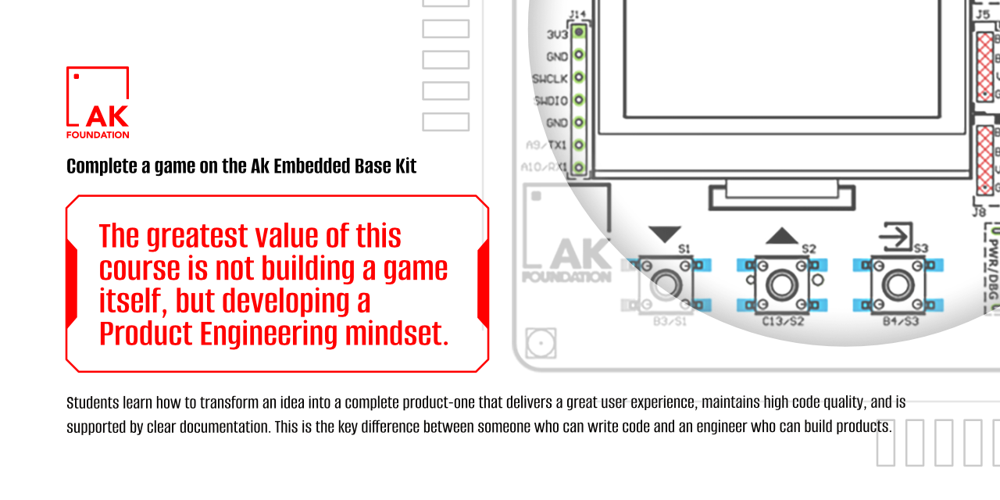
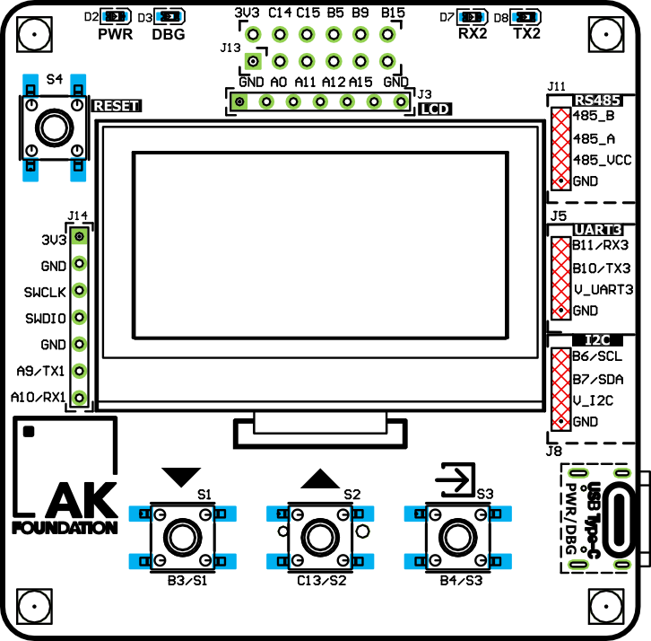
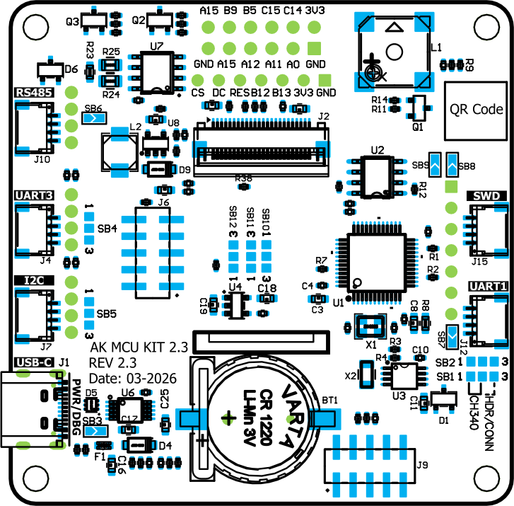
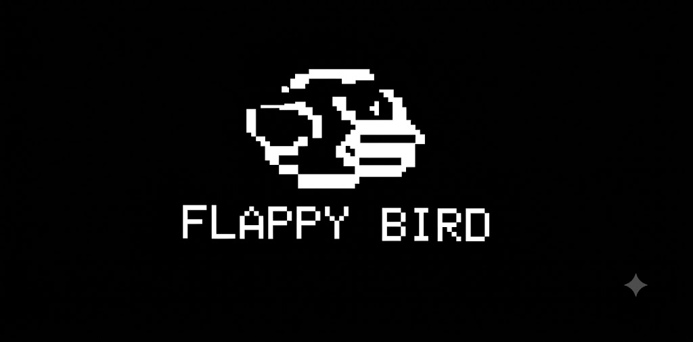

<div align="center">
  


</div>

## Flappy Bird Game - Game built on AK Embedded Base Kit

<figure align="center">
  
  <figcaption><b>Figure 1.</b> Flappy Bird Game</figcaption>
</figure>

## Gameplay demo

## Documentation

| File | Description |
|------|-------------|
| README.md | Main project overview, hardware information, gameplay rules, and game object descriptions. |
| docs/01-guide-getting-started.md | Getting started guide for building and running the project. |
| docs/02-guide-coding-rules.md | Coding conventions and project development guidelines. |
| docs/03-design-game-objects.md | Design and behavior of gameplay objects: Bird, Pipe, Ground, Score, and UI. |
| docs/04-design-runtime.md | Runtime event flow, game loop, state machine, button handling, and rendering process. |

## Introduction

Flappy Bird is a side-scrolling arcade game built on top of the AK Embedded Base Kit — an educational platform designed for learning modern embedded software development through interactive applications. The project recreates the classic Flappy Bird gameplay on a 128×64 OLED display using the STM32L151 microcontroller and the AK Embedded Framework.

While developing and playing Flappy Bird, you will explore several core concepts of embedded systems engineering:

- Software architecture: Organizing the application into independent screens, game objects, and reusable modules.
- Event-driven programming: Processing button inputs, timers, and system events to create responsive gameplay.
- Real-time game loop: Updating object positions, rendering graphics, detecting collisions, and calculating scores at fixed intervals.
- State management: Implementing finite state machines to control screen transitions, gameplay flow, and game-over conditions.

[](https://github.com/the-ak-foundation)

This kit would not have been possible without the help of [EPCB](https://epcb.vn/pages/frontpage).

AK Embedded Base Kit, utilizing STM32L151 MCU, is an evaluation kit for advanced embedded software learners.

# I. Features

- This kit integrates 1.54" Oled LCD, 3 push buttons, and 1 buzzer, which would be sufficient to create a small video game with an event driven paradigm.
- It also includes RS485, Qwiic Connect System, and Grove Ecosystems, suitable for prototyping other practical applications in embedded systems.

[](<https://epcb.vn/products/ak-embedded-base-kit-lap-trinh-nhung-vi-dieu-khien-mcu>)

# Purpose

Students who are enrolled in the AK foundation's embedded training program will make use of this evaluation kit to develop a small unique video game that will be able to run smoothly as well as closely follow an event driven paradigm in embedded systems programming. This repository also contains all the code which would form the AK framework that students can use to facilitate their development process.

We also hope that this repository will also be useful for those are on the look out for a well-built kit to practice their embedded systems programming skills.


[](<https://epcb.vn/products/ak-embedded-base-kit-lap-trinh-nhung-vi-dieu-khien-mcu>)

# Memory map

AK base kit uses the following memory map to run its application code

- [ 0x08000000 ] : **Boot** [[ak-base-kit-stm32l151-boot.bin]](https://github.com/ak-embedded-software/ak-base-kit-stm32l151/blob/main/hardware/bin/ak-base-kit-stm32l151-boot.bin)
- [ 0x08002000 ] : **BSF** [ Memory for data sharing between Boot and Application ]
- [ 0x08003000 ] : **Application** [[ak-base-kit-stm32l151-application.bin]](https://github.com/ak-embedded-software/ak-base-kit-stm32l151/blob/main/hardware/bin/ak-base-kit-stm32l151-application.bin)                                             |

>**Note:** After loading the boot and application firmware, you can use [AK - Flash](https://github.com/ak-embedded-software/ak-flash), a CLI to work with the AK base kit, to load the application directly through the kit's USB port. Once installed, the following command will flash user's defined code into the kit's application's memory region.

```sh
ak_flash /dev/ttyUSB0 ak-base-kit-stm32l151-application.bin 0x08003000
```

# Hardware

[AK base kit's schematic](/hardware/schematic/schematic-ak-embedded-base-kit-version-3.pdf)

[](<https://epcb.vn/products/ak-embedded-base-kit-lap-trinh-nhung-vi-dieu-khien-mcu>)

[](https://epcb.vn/products/ak-embedded-base-kit-lap-trinh-nhung-vi-dieu-khien-mcu)

# Reference

| Topic | Link |
| ------ | ------ |
| Training course | <https://github.com/the-ak-foundation/embedded-training-program> |
| Tutorials | <https://epcb.vn/blogs/ak-embedded-software> |
| Vendor | <https://epcb.vn/products/ak-embedded-base-kit-lap-trinh-nhung-vi-dieu-khien-mcu> |

# II. Game Description and Objects
The following section describes the gameplay and core mechanics of Fly Hunter. It serves as a reference for understanding the game's mechanics and firmware implementation. Opens on the Main Menu, which offers the following options:


